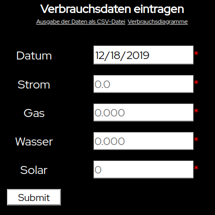

# Verbrauchswerte
Dokumentation des Strom-, Gas-, Wasserverbrauchs und der Solarthermie eines Einfamilienhauses

1) Dateien in einen Ordner eines Webservers mit PHP-Unterstützung legen.
2) .htaccess konfiguieren (Das Projekt selber hat keine Authentifizierung und soll nur im internen, vertrauenswürdigen Netzwerk betrieben werden)
3) Eintragen, Auslesen und Darstellen der Daten durch Aufruf der Startseite (index.php)

